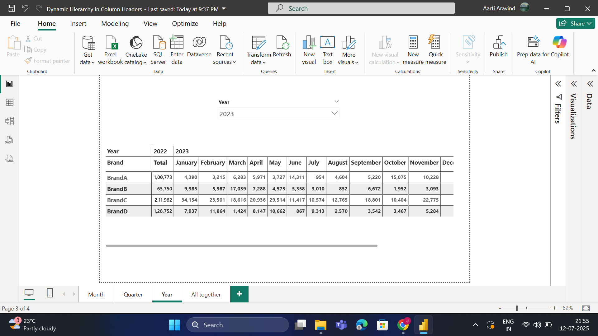
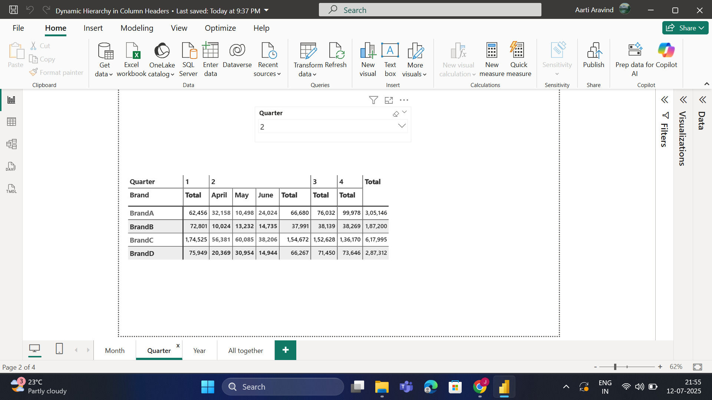
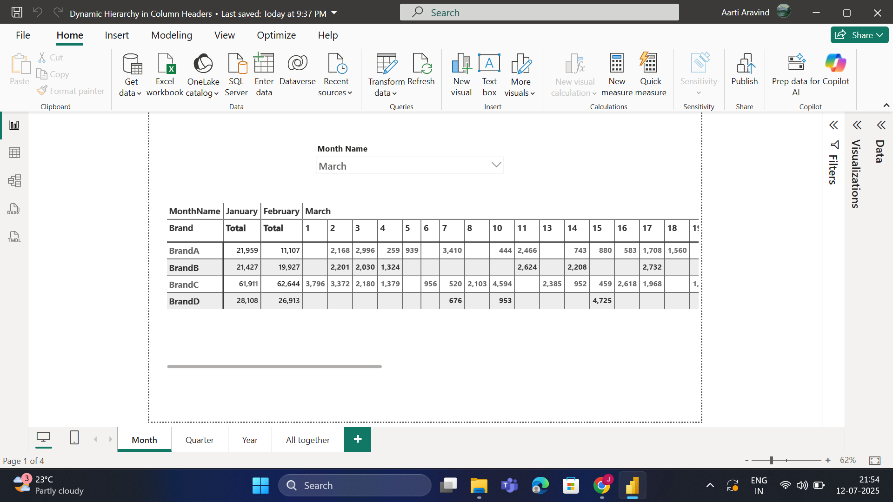
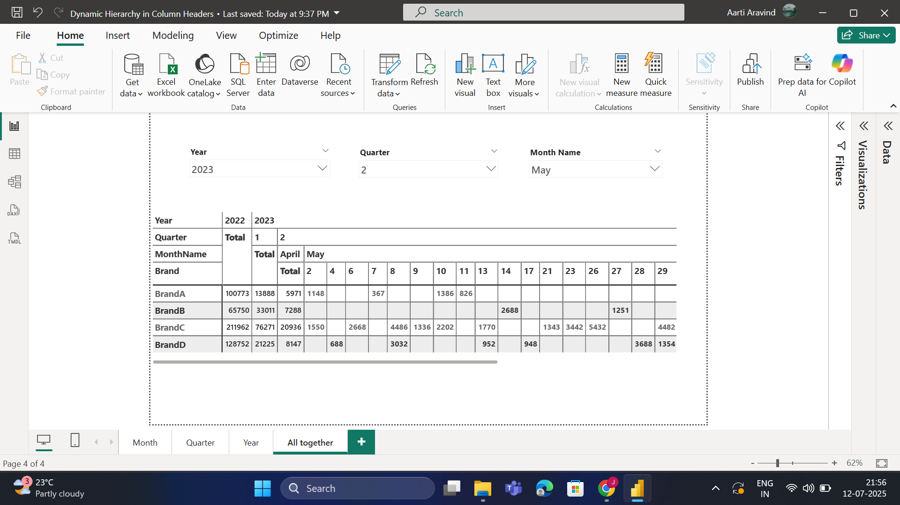

# 🚀 Dynamic Drill-Down in Power BI Matrix

This Power BI report demonstrates a smart, **DAX-driven dynamic hierarchy** in **matrix column headers**, enabling users to drill through seamlessly from:

**Year → Quarter → Month → Day** — all in a single visual and with a **single dynamic measure**.

---

## 🔍 Key Features

- 📊 Matrix visual with dynamic drill-down on **columns**
- 🧠 One smart DAX measure adapts based on visible hierarchy level
- 🧼 Cleaner report layout with fewer visuals
- 🧭 Enhanced interactivity and flexible navigation
- ⚡ Ideal for executive dashboards and analytical reports

---

## 🗂️ Drill-Down Hierarchy Levels

1. **Year**
2. **Quarter**
3. **Month**
4. **Day**

---

## 🛠️ Technologies Used

- Power BI Desktop (`.pbix`)
- DAX (Data Analysis Expressions)
- Matrix Visual
- Date Table with hierarchy

---

## 📁 Repository Structure

PowerBI-Dynamic-Drilldown/
├── PBIX File/
│ └── DynamicMatrixDrilldown.pbix
│
├── Dax/
│ ├── Dynamic_Total_Sales_Hierarchy.txt
│ ├── New_Total_Sales_Year.txt
│ ├── New_Total_Sales_Quarter.txt
│ └── New_Total_Sales_Month.txt
│
├── Screenshots/
│ ├── Month.png
│ ├── Quarter.png
│ ├── Year.png
│ └── All Together.png
│
├── Demo/
│ └── MatrixDrilldownDemo.mp4
|
├── Dataset/
│  └── Sample_Dataset.xlsx

---

## 📸 Screenshots

| Drill-down Level |                   Screenshot                       |
|------------------|----------------------------------------------------|
| Year View        |                  |
| Quarter View     |            |
| Month View       |                |
| Overall View     |  |

---

## 🎥 Video Demo

📽️ [Click here to watch the demo video](Demo/MatrixDrilldownDemo.mp4)

> Or download the video from the `Demo` folder to view offline.

---

## 🧮 DAX Measures

DAX logic is stored in the `Dax/` folder for reference. Core measures include:

- `Dynamic_Total_Sales_Hierarchy`
- `New_Total_Sales_Year`
- `New_Total_Sales_Quarter`
- `New_Total_Sales_Month`

> Explore [DAX formulas here](Dax/)

---

## 📊 Sample Dataset

The dataset used in this Power BI report is available in the [`Dataset/`](Dataset/) folder.

- [Sample_Dataset.xlsx](Dataset/Sample_Dataset.xlsx)

---

## 📥 How to Use

1. Clone/download this repository.
2. Open `PBIX File/DynamicMatrixDrilldown.pbix` using Power BI Desktop.
3. Click on the **matrix visual** and drill down column headers (Year → Day).
4. Review DAX formulas in the **Dax** folder.
5. Optionally view the **video demo** in the `Demo` folder.

---

## 🙋 Author

**Jamuna S**  
📧 Email: [jamuna.official08@gmail.com](mailto:jamuna.official08@gmail.com)  
🔗 [LinkedIn](https://www.linkedin.com/in/jamuna-s-9b3a19358/)

---

## 🏷️ Tags

`#PowerBI` `#DAX` `#DataVisualization` `#DynamicHierarchy` `#InteractiveReports` `#MatrixVisual` `#BusinessIntelligence` `#PowerBITips`

---

> ⭐ Don’t forget to star the repo if you find it helpful!
